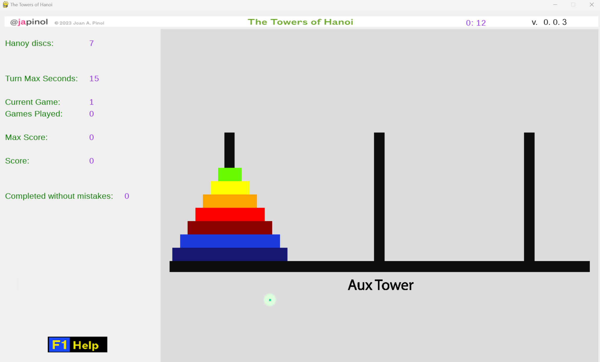
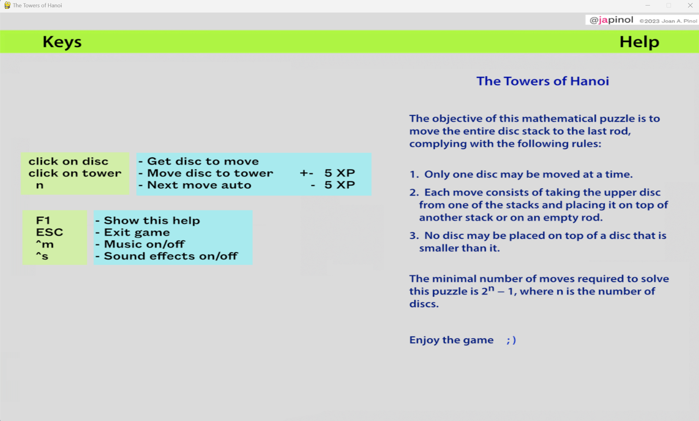

## The Towers of Hanoi
    Explore the mathematical game puzzle The Towers of Hanoi with this amazing interactive game.

   * The program 

	program: The Towers of Hanoi.
    name as a package: hanoitowers 
	version: 0.0.1
	author: Joan A. Pinol
	author_nickname: japinol
	author_gitHub: japinol7
	author_twitter: @japinol
	requirements: pygame or pygame-ce
	Python requires: 3.11 or greater.
	Python versions tested: 
        > 3.11.4 64bits under Windows 11 and pygame-ce 2.3.1

## Rules and user guide

The objective of this mathematical game puzzle is to move the entire disc stack to the last rod,   
complying with the following rules:  

1. Only move one disc at a time.
2. Each move consists of taking the upper disc from one of the stacks   
   and placing it on top of another stack or on an empty rod.
3. No disc may be placed on top of a disc that is smaller than it.

The minimal number of moves required to solve this puzzle is 2n − 1,   
where n is the number of discs.

Enjoy the game     ; )

## Keyboard keys
       F1:    show a help screen while playing the game
       ESC:   exit game
       ^m:    pause/resume music
       ^s:    sound effects on/off
       L_Alt + Enter: change full screen / windowed screen mode
       ^h:    shows this help to the console

    > Additional keys for debug mode:
       ^d:    print debug information to the console and the log file

## Screenshots

    
  

## Usage

	usage: hanoitowers [-h] [-a] [-g GAMESTOPLAY] [-i DISCS] [-l] [-m] [-n] [-s] [-u TURNMAXSECS] [-d] [-t]
	
	optional arguments:
	  -h, --help            show this help message and exit.
	  -a, --auto            Auto mode. It does not stop between games.
	                        Only when it needs a user input
	  -g, --gamestoplay GAMESTOPLAY
	                        Games to play. Must be between 0 and 5000.
	  -i, --discs DISCS
	                        Number of hanoi discs. Must be between 1 and 7.
	  -l, --multiplelogfiles
	                        A log file by app execution, instead of one unique log file.
	  -m, --stdoutlog
	                        Print logs to the console along with writing them to the log file.
	  -n, --nologdatetime
	                        Logs will not print a datetime.
      -s, --solver
	                        solver algorithm. Available solvers: iterative, recursive
	  -u, --turnmaxsecs TURNMAXSECS
	                        Turn max seconds before the player loses 5 score points.
	                        Must be between 5 and 900.
	  -d, --debug
	                        Debug actions when pressing the right key, information and traces.
	  -t, --debugtraces
	                        show debug back traces information when something goes wrong.

**Default optional arguments**

	auto                False
	discs               5
	solver              iterative
	gamestoplay         0, that is, infinite
	turnmaxsecs         15
	multiplelogfiles    False
	stdoutlog           False
	nologdatetime       False
    debug               False
	debugtraces         False

**More info on The Towers of Hanoi**

* On Wikipedia
  * [Wikipedia - Tower of Hanoi](https://en.wikipedia.org/wiki/Tower_of_Hanoi)

* MIT video on YouTube by Richard Larson
  * [BLOSSOMS - The Towers of Hanoi- Experiential Recursive Thinking](https://www.youtube.com/watch?v=WftWSVhJ0zc)

**Examples of usage**

    > Play infinite games with the default 5 discs:
       $ python -m hanoitowers

    > Play with 3 discs:
       $ python -m hanoitowers --discs 3

    > Play with 3 discs with the auto solver using the recursive algorithm:
       $ python -m hanoitowers --discs 3 --solver recursive

    > Play with 3 discs and multiple log files while echoing logging to the console. No datetime:
       $ python -m hanoitowers --discs 3 --stdoutlog --multiplelogfiles --nologdatetime

    > Play with 7 discs and multiple log files while echoing logging to the console:
       $ python -m hanoitowers --discs 7 --stdoutlog --multiplelogfiles

**To make The Towers of Hanoi work**

	Do this:
	    1. Clone this repository in your local system.
	    2. Go to its folder in your system.
	    3. $ pip install -r requirements.txt
	    4. $ python -m hanoitowers
